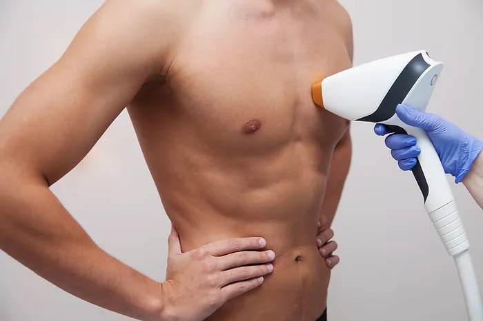

+++
title = "Say Goodbye to Unwanted Hair: Introduction About Pain-Free Laser Hair Removal"
aliases = ["/post/say-goodbye-to-unwanted-hair-the-truth-about-pain-free-laser-hair-removalintroduction"]
date = 2024-04-15
+++

Many have turned to laser hair removal as a long-lasting solution in the quest for smooth, hair-free skin. However, one common concern that often arises is the level of discomfort associated with the procedure. Fear not! With advancements in technology, pain-free laser hair removal has become a reality, offering a comfortable and effective hair removal experience. Let's dive into the truth behind pain-free laser hair removal and why it might be the solution you've been searching for.

### Understanding Laser Hair Removal:

Before delving into the pain-free aspect, let's first understand how laser hair removal works. This popular cosmetic procedure involves the use of concentrated beams of light to target and destroy hair follicles, inhibiting future hair growth. Unlike shaving or waxing, which only provide temporary results, laser hair removal offers long-term reduction in hair growth, makes it a popular choice for those seeking smooth, hair-free skin.

### The Myth of Painful Laser Hair Removal:

One of the biggest misconceptions about laser hair removal is that it's a painful procedure. Many people associate laser treatments with sensations of discomfort or even pain. However, it's essential to differentiate between older laser technologies and the advancements that have been made in recent years.

### The Reality of Pain-Free Laser Hair Removal:

Thanks to technological advancements, pain-free laser hair removal is now a reality. Newer laser systems incorporate innovative features such as cooling mechanisms and adjustable settings to ensure a comfortable experience for the patient. These advancements significantly reduce the discomfort often associated with traditional laser hair removal methods.

### How Does Pain-Free Laser Hair Removal Work?

Pain-free laser hair removal works by targeting the hair follicles with gentle pulses of light energy. Unlike older systems that rely solely on high-intensity laser beams, modern devices utilize advanced cooling technology to numb the skin and minimize any sensation of discomfort. This ensures the treatment is virtually painless, allowing patients to undergo multiple sessions without experiencing undue discomfort.

### Benefits of Pain-Free Laser Hair Removal:

Comfort: The primary benefit of pain-free laser hair removal is its comfort during treatment. Patients can undergo sessions without experiencing the discomfort often associated with traditional laser methods.

Speed: Pain-free laser hair removal treatments are typically quicker than traditional methods, allowing faster and more efficient hair removal sessions.

Precision: Modern laser systems offer precise targeting of hair follicles, ensuring effective results without causing damage to the surrounding skin.

Long-lasting results: Just like traditional laser hair removal, pain-free treatments offer long-lasting reduction in hair growth, providing patients with smooth, hair-free skin for an extended period.

### In Conclusion:

Say goodbye to the discomfort of traditional laser hair removal and embrace the era of pain-free hair removal treatments. With advanced technology and innovative techniques, pain-free laser hair removal offers an effective, comfortable solution for achieving smooth, hair-free skin. If you've been hesitant to try laser hair removal due to fear of pain, now is the time to explore the benefits of pain-free treatments. Say hello to a new era of hair removal and rediscover the confidence that comes with smooth, hair-free skin.

### Disclaimer: 

It's important to note that individual experiences with laser hair removal may vary. Consultation with a qualified healthcare professional is recommended to determine if laser hair removal is suitable for your specific needs and skin type.